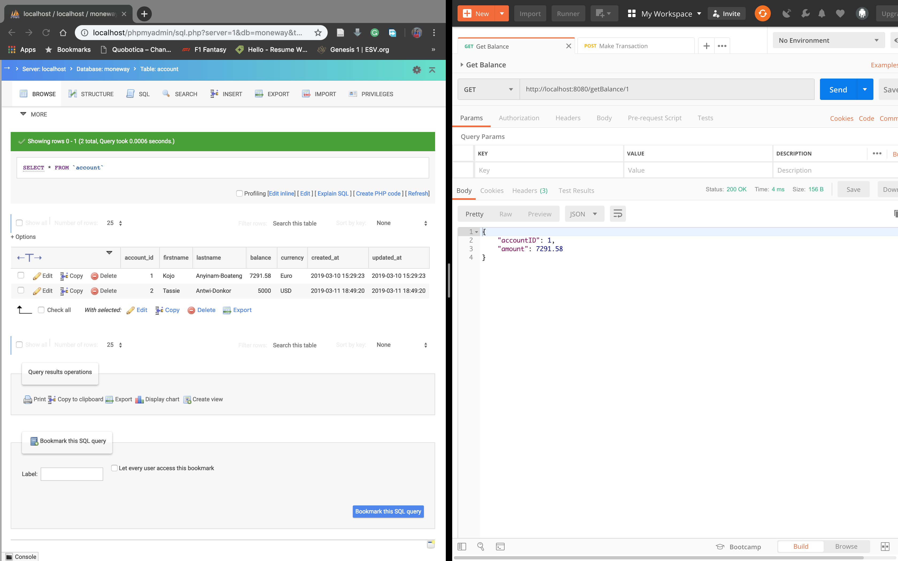

# Moneway
### Version 1.1
This is an intern assessment for the position of a go developper at Moneway.

This is a simulation of a transaction and update of a balance. There are two services, "balance" and "transaction". The "balance" service is responsible for handling the balance within the database, and the "transaction" service is responsible for updating the balance (by contacting the balance service) and storing the transaction data.

These are the Features:
1. list the balance
2. Credit and debit an Account
3. Create transactions
4. Update the balance 

The goal of the exercise is to apply (at most) the good practices of microservices ([microservices.io](https:microservices.io) and [gRPC](grpc.io)), the mastery of the Go language, and the mastery of database operations.

## Database
This makes use of MySql Database

In the **config/config.env** file you will find the configuration file for the Database. Make changes to suit your database settings. 

      DB_SERVER = localhost
      DB_PORT = 3306
      DB = moneway
      DB_USER = your username
      DB_PASSOWRD = your password
      

The database schema could be found in the **moneway.sql** file.

## Port Configuration
Also in the **config/config.env** file you will find the configuration file for the various ports. Make changes to suit your available ports. 

      MAIN_PORT = 8080 //Main server
      TRANSACTION_PORT = 8081 //Transaction Service
      BALANCE_PORT = 8082 //Balance Service

## Building and Running
1. Download and install [Postman](https://www.getpostman.com/downloads/) and import the **Moneway Test.postman_collection.json** file.

2. Open a terminal in the **Moneway Directory** and execute the following command:
 
       source run.sh; balance-server
      
3. In another terminal in the **Moneway Directory** and execute the following command:
 
       source run.sh; transaction-server
 
4. In another terminal in the **Moneway Directory** and execute the following command:
 
       source run.sh; main-server
       
5. You can now send the Get Balance and Make Transaction in Postman.

### Making A Transaction
Structure of Transaction Object

      "transaction": {
            "AccountID" : "1", 
            "Description" : "This is a test", 
            "Amount" : 350.00, 
            "Currency" : "Euro", 
            "TransactionType" : "CREDIT"
      }
      
TransactionType can be either **CREDIT** or **DEBIT**

## Test Results
1. Running the various servers in terminal. 

2. Executing the get balance in Postman.

3. Log from the Get Balance Request in the terminal.

4. Database before the Make Transaction Request was sent.

5. Database after the Make Transaction Request was sent.

6. Showing the updated balance after the Make Transaction Request was sent.

7. Logs from the various transactions.

## Future Works
 1. In order for easy workflow within Moneway, we will be migrating to ScyllaDB.
 2. Making the system more secure.
